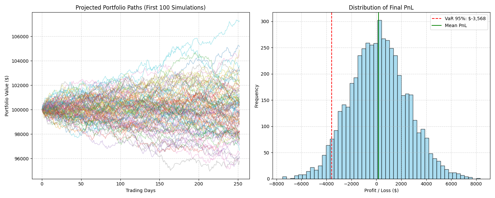

# Monte Carlo Portfolio Risk Simulation

## Overview
This is a Python project that estimates the potential risk of a stock portfolio using a **Monte Carlo simulation**. 

The goal is to model how a portfolio containing **Apple (AAPL)**, **Nvidia (NVDA)**, and **Intel (INTC)** might perform over a 1-year trading horizon (252 days). By simulating thousands of possible future price paths based on historical data, the project calculates the probability of different profit or loss scenarios.

## Motivation
I built this project to learn more about quantitative finance and risk management. Specifically, I wanted to understand:
* How to implement **Geometric Brownian Motion (GBM)** for stock price modeling.
* How to handle correlations between different assets using **Cholesky Decomposition**.
* How to calculate standard industry risk metrics like **Value at Risk (VaR)** and **Conditional Value at Risk (CVaR)** from scratch.

This is primarily an academic/learning project to demonstrate how risk modeling works in code.

## Methodology
The simulation follows these four steps:

1.  **Data Loading:** I load historical daily closing prices for the selected assets from a CSV file.
2.  **Statistical Analysis:** The code calculates daily log returns, mean returns, and the covariance matrix to understand how the stocks move individually and together.
3.  **Monte Carlo Simulation:** The project runs **5,000 simulations** over a **252-day horizon**.
    * It uses random shocks to simulate daily returns.
    * Crucially, it preserves the historical correlations between assets (e.g., if AAPL and NVDA tend to move together, they do so in the simulation).
4.  **Risk Metrics:** By analyzing the distribution of the final portfolio values across all 5,000 simulations, I calculate the potential downside risk (VaR and CVaR).

## Project Structure
* `main.py`: The entry point of the project. It connects all the modules, runs the simulation, and prints the summary.
* `prices.py`: A utility script that downloads the raw historical data from [Stooq](https://stooq.com) and saves it to `prices.csv`.
* `src/data_loader.py`: Handles reading the CSV file and calculating log returns/covariance.
* `src/simulation.py`: Contains the core logic for the Monte Carlo simulation (GBM and Cholesky decomposition).
* `src/risk_metrics.py`: Calculates VaR, CVaR, and other statistics from the simulation results.
* `src/visualization.py`: Generates plots for the simulated paths and the PnL distribution.
* `Monte_Carlo_Risk_Simulation.ipynb`: A Jupyter Notebook version of the project, useful for presentation and step-by-step analysis.
* `data/prices.csv`: The dataset used for the simulation.

## Data
The project uses a CSV dataset (`prices.csv`) containing daily closing prices for:
* **AAPL** (Apple)
* **NVDA** (Nvidia)
* **INTC** (Intel)

The data covers the period from **January 2, 2025, to December 31, 2025**.

## How to Run
To run this project locally, you need Python installed along with `numpy`, `pandas`, `matplotlib` and `pandas_datareader`.

1.  **Install dependencies:**
    ```bash
    pip install numpy pandas matplotlib pandas_datareader
    ```

2.  **Run the script:**
    ```bash
    python main.py
    ```

Alternatively, you can open `Monte_Carlo_Risk_Simulation.ipynb` in Jupyter Notebook or VS Code to run the analysis interactively.

## Results
When you run the project, it outputs a risk summary to the console, similar to this:

* **Expected Ending Value:** The average portfolio value across all simulations.
* **VaR 95%:** The loss threshold we are 95% confident we won't exceed.
* **CVaR 95%:** The average loss in the worst 5% of cases (tail risk).
* **Worst Simulated PnL:** The absolute worst outcome observed in the simulation.

It also generates two plots:
1.  **Portfolio Paths:** A visualization of the simulated price trajectories.
2.  **PnL Distribution:** A histogram showing the spread of profits and losses, with the VaR threshold marked.


*(Note: This plot is generated by the `visualization.py` script)*

### Results & Insights
1. **Projected Portfolio Paths (Left Graph):**
* **What it shows**: A visualization of 100 simulated future price trajectories for the portfolio over the next year (out of 5,000 total).
* **Insight**: This illustrates volatility. While many paths trend upwards, others dip significantly below the starting value, visualizing the uncertainty of future returns.
2. **Distribution of Final PnL (Right Graph):**
* **What it shows**: A histogram separates the Profit/Loss outcomes from all 5,000 simulations.
* **Mean PnL (Green Line)**: The average expected profit, which is positive, suggesting growth on average.
* **VaR 95% (Red Line)**: The "danger zone". It indicates that in the worst 5% of cases, losses would exceed this threshold.

## Limitations
Since this is a student project, there are a few limitations to keep in mind:
* **Normal Distribution Assumption:** The model assumes stock returns are normally distributed. In reality, markets often have "fat tails" (extreme events happen more often than predicted).
* **Historical Bias:** The simulation assumes that future volatility and correlations will look like the past (`prices.csv`), which isn't always true.
* **Simple Portfolio:** The portfolio is equally weighted (33% each) and does not account for dividends or transaction costs.

## Future Improvements
* Add more assets to the portfolio to see the effect of diversification.
* Implement different distributions (like Student's t-distribution) to model "fat tail" risk better.
* Allow for custom portfolio weights instead of just equal weighting.
